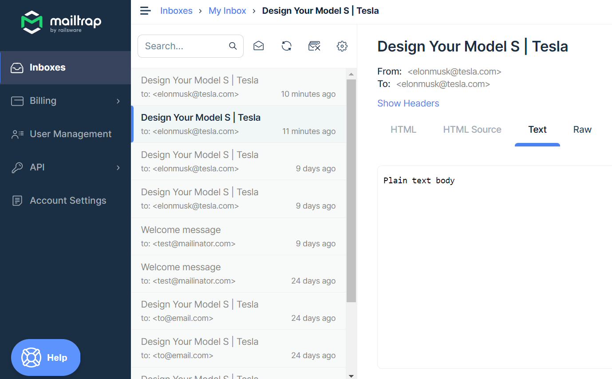

## App name
send email using code

[](https://github.com/NodeJSEngineering/) [](https://github.com/NodeJSEngineering/) [](https://github.com/NodeJSEngineering/handle-emails/stargazers) [](https://github.com/NodeJSEngineering/handle-emails/network)

<p align="center">
<a href="#">

</a>
</p>

#### Link for [demo](#) 
[](#)

## Useful Links

- [api to send email using ejs](http://localhost:3000/send-newsletter-on-email)
- [api to send basic mail](http://localhost:3000/send-simple-mail)


## Requirements

[](https://github.com/NodeJSEngineering/)

The source code of this project is written in **`JavaScript`, and used `nodemailer`**. 

## Instructions

[](#)

Open the project and run ` npm run start`

## Pre-requisites
npm, nodejs
## Objective of the project.
upload build
## Tech stacks used
nodejs
## How to build the application.
create multiple JS files
## How to test the application.
test
## Software tools used.
vscode
## Tangible results.
build deploy
## GIFs showing user flows (if customer-facing)
Templates/screenshots of all the project pages

## Links to web pages
blog link
## Links to code/GitHub repository link
https://github.com/NodeJSEngineering/handle-emails
## Duration
1 month
## build creation and deployment
[command](https://dashboard.heroku.com/apps/testnodeappnew)
## Features
newsletter like email you can send

## Support
Don't Forget to bookmark/star this repo.

## buy me a coffee /Sponsor this project
ko-fi.com/softwaredev

## Need help?

Feel free to contact me via [Link](https://bio.link/angulardev).

[](https://www.facebook.com/learnangular2plus/) [](https://www.quora.com/profile/Sunny-Gupta-208) [](https://www.instagram.com/angular_development/) [](https://eraoftech.medium.com/ )


```bash


 _____ _                 _     __   __            
|_   _| |               | |    \ \ / /            
  | | | |__   __ _ _ __ | | __  \ V /___  _   _   
  | | | '_ \ / _` | '_ \| |/ /   \ // _ \| | | |  
  | | | | | | (_| | | | |   <    | | (_) | |_| |  
  \_/ |_| |_|\__,_|_| |_|_|\_\   \_/\___/ \__,_|  
                                                  
                                                  
______                                            
|  ___|                                           
| |_ ___  _ __                                    
|  _/ _ \| '__|                                   
| || (_) | |                                      
\_| \___/|_|                                      
                                                  
                                                  
______      _               _   _               _ 
| ___ \    (_)             | | | |             | |
| |_/ / ___ _ _ __   __ _  | |_| | ___ _ __ ___| |
| ___ \/ _ \ | '_ \ / _` | |  _  |/ _ \ '__/ _ \ |
| |_/ /  __/ | | | | (_| | | | | |  __/ | |  __/_|
\____/ \___|_|_| |_|\__, | \_| |_/\___|_|  \___(_)
                     __/ |                        
                    |___/                         

 


```

## License

**MIT &copy; [Sunny](https://github.com/NodeJSEngineering/handle-emails/blob/master/LICENSE)**

[](https://github.com/NodeJSEngineering/handle-emails/blob/master/LICENSE)

---------

```javascript

if (youEnjoyed) {
    starThisRepository();
}

```

-----------


